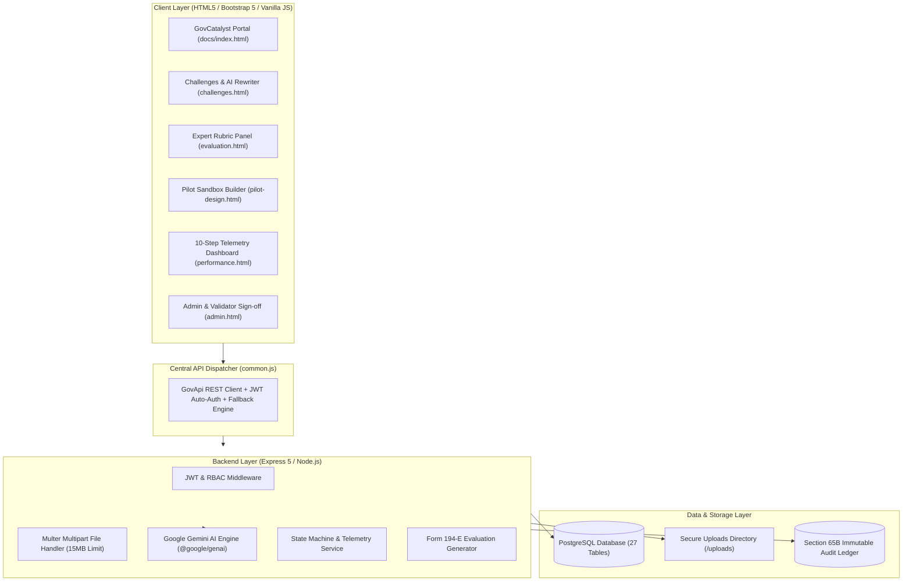

# 🏛️ GovCatalyst (SIH Problem Statement 26136)

> **Empowering Public Sector Innovation** — A Transparent, GFR Rule 194-Compliant Sandbox & Commercial Scale-Up Bridge for Startups and Government Departments.

[](https://govcatalyst.onrender.com)
[](https://tusshar-web.github.io/GovCatalyst/)
[](https://render.com)
[](https://nodejs.org)
[](https://ai.google.dev)
[](#-legal--regulatory-framework)

---

## 📌 Live Demo Links

| Service | Live Deployment URL | Description |
|---|---|---|
| 🌐 **Fullstack Cloud App (Render)** | [https://govcatalyst.onrender.com](https://govcatalyst.onrender.com) | Express Backend + Static Frontend + PostgreSQL + Multer Uploads |
| 📄 **Frontend Dashboard (GitHub Pages)** | [https://tusshar-web.github.io/GovCatalyst/](https://tusshar-web.github.io/GovCatalyst/) | Static Client connecting to Render Backend REST APIs |
| 🩺 **Backend Health Endpoint** | [https://govcatalyst.onrender.com/api/health](https://govcatalyst.onrender.com/api/health) | Returns `{"success": true, "status": "HEALTHY"}` |

---

## 📖 Executive Summary

GovCatalyst solves the fundamental friction in public procurement: **How can government departments procure innovative solutions from early-stage startups without violating public tender norms?**

Under standard procurement rules, startups with no 3-year financial track record or turnover are disqualified. Under **General Financial Rules (GFR) Rule 194**, departments are empowered to run **outcome-based sandbox pilots**, evaluate verifiable evidence under independent scrutiny, and transition successful innovations into direct statewide procurement contracts without traditional tender delays.

GovCatalyst automates the entire **10-Step Innovation Procurement Lifecycle**:

```
Challenge Definition (AI Outcome Rewriter)
  └── Startup Discovery & DPIIT Screening
        └── AI Proposal Scoring & Shortlisting (≥ 75%)
              └── Expert Panel Scoring & COI Governance
                    └── Sandbox Pilot Design & 14-Point Cyber Gating
                          └── 10-Step Real-Time KPI Telemetry & Alerts
                                └── Independent Validation & Form 194-E Evaluation
                                      └── Automated Scale-Up & GeM Procurement Transition
```

---

## 🏗️ System Architecture



---

## 📦 Core Modules & Implemented Features

### 1. 🔐 Authentication & RBAC Governance
- **Roles**: `super_admin`, `dept_admin`, `startup`, `evaluator`, `validator`.
- **Approval Workflow**: Non-startup registrations enter `pending` state; Super Admin receives automated Gmail alert, reviews credentials in [`admin.html`](file:///c:/Users/tussh/OneDrive/Desktop/govCatalyst/docs/admin.html), and approves triggering a 6-digit OTP email via Nodemailer.
- **Security**: Password hashing via `bcryptjs`, JWT bearer authentication tokens, role-restricted middleware guards.

### 2. 🚀 DPIIT Startup Verification & Registry
- Integrated registry checks for DPIIT Recognition (`DIPPXXXXX`) enabling tax and turnover exemptions under Startup India regulations.

### 3. 🎯 Outcome-Based Challenge Builder (GFR Rule 194)
- Converts departmental pain points into measurable outcome statements using **Google Gemini AI**.
- Captures budget ceilings, pilot duration, sector taxonomy (`AI/ML`, `CleanTech`, `IoT`, `HealthTech`, `AgriTech`), and risk levels.

### 4. 🤖 AI Proposal Screening & Automated Shortlisting
- Analyzes startup bids against departmental outcomes; generates **0–100 Feasibility Score** with automated shortlisting at $\ge 75\%$.

### 5. 🧑‍⚖️ Expert Evaluation Panel & Conflict of Interest (COI)
- 5-criterion weighted scoring rubrics (`Technical Feasibility`, `Novelty`, `Outcome Alignment`, `Cost Effectiveness`, `Track Record`).
- Mandatory Conflict of Interest declaration with automated evaluator reassignment and formal startup appeal mechanism.

### 6. 🛡️ Sandbox Pilot Design & 14-Point Cybersecurity Gating
- 13-state deterministic state machine (`DRAFT` $\rightarrow$ `ACTIVE` $\rightarrow$ `EVALUATED` $\rightarrow$ `SCALE`/`MODIFY`/`STOP`).
- **14-point cybersecurity checklist** covering data isolation, SSL/TLS, penetration testing, and DPIIT IP ownership protection.
- Auto-generates 22-section bilateral legal sandbox agreements.

### 7. 📊 10-Step KPI Telemetry & Real-Time Monitoring Engine
- **Outcome Statement**: Clear expected results (e.g. *Reduce municipal solid waste collection cost by 15%*).
- **4–8 Measurable KPIs**: Baseline, Target, Minimum Acceptable Tolerance, Actual Readings, and % Improvement.
- **Multi-Source Telemetry Ingestion**:
  - `MANUAL` (Portal entry)
  - `CSV_UPLOAD` (Batch parsing)
  - `REST_API` (Webhook ingest)
  - `IOT_SENSOR` (Automated hardware streams)
  - `GOVT_ERP` (Legacy state systems)
- **RAG Status Classification**: 🟢 Green (On Track $\ge 90\%$), 🟡 Yellow (At Risk $60–89\%$), 🔴 Red (Behind Target $< 60\%$).
- **Automated Threshold Breach Alerts**: Emits real-time warnings to Department Officers and Startups on lagging KPIs.
- **Form 194-E Pilot Evaluation Report**: Printable official government evaluation report with tamper-proof Section 65B Indian Evidence Act seal.
- **Automated Scale-Up Recommendation Engine**:
  - 🟢 **`SCALE`** ($\ge 85\%$ Target Achievement): Direct GFR 194 commercial procurement.
  - 🟡 **`MODIFY & RETEST`** ($60–84\%$): 30–60 day sandbox parameter tuning.
  - 🔴 **`STOP`** ($< 60\%$): Close sandbox trial.

### 8. 📁 Multipart File Upload System (Multer)
- Secure handling of evidence files, invoices, lab test reports, GPS traces (`.geojson`), and CSV telemetry streams via `/api/upload/single` and `/api/upload/csv-telemetry`.

### 9. 🔍 Independent Third-Party Validation Layer
- Evaluator sign-offs (`VERIFIED`, `PARTIALLY_VERIFIED`, `NOT_VERIFIED`) with discrepancy calculation and objection logging.

### 10. 🏛️ Section 65B Immutable Audit Trail
- System-wide event logging recording every state transition, score modification, telemetry ingestion, and evaluator sign-off.

---

## 🛠️ Tech Stack & Dependencies

```json
{
  "runtime": "Node.js (>=18.0.0)",
  "framework": "Express 5.2.1",
  "database": "PostgreSQL 16 (pg 8.23.0)",
  "ai": "@google/genai 2.19.0 (Gemini Pro)",
  "file_upload": "multer 1.4.5-lts.1",
  "authentication": "jsonwebtoken + bcryptjs",
  "email_service": "nodemailer (SMTP Gmail)",
  "validation": "joi 18.2.5",
  "frontend": "HTML5, Vanilla CSS3, Bootstrap 5.3, Bootstrap Icons"
}
```

---

## ⚡ Local Setup & Installation

### Prerequisites
- Node.js (v18+)
- PostgreSQL Database installed locally or cloud connection string

### 1. Clone Repository
```bash
git clone https://github.com/Tusshar-web/GovCatalyst.git
cd GovCatalyst
```

### 2. Install Dependencies
```bash
# Installs server and root dependencies
npm run install:server
```

### 3. Configure Environment Variables
Create `server/.env`:
```env
PORT=5009
DB_HOST=localhost
DB_PORT=5432
DB_NAME=GovBridge
DB_USER=postgres
DB_PASSWORD=your_postgres_password
JWT_SECRET=your_super_secret_jwt_key
GEMINI_API_KEY=your_gemini_api_key
SUPERADMIN_EMAIL=learnova.service@gmail.com
SMTP_HOST=smtp.gmail.com
SMTP_PORT=587
SMTP_USER=your_email@gmail.com
SMTP_PASS=your_gmail_app_password
```

### 4. Seed Database
```bash
node server/seed-startup.js
node server/seed-dept-admin.js
node server/seed-challenges.js
node server/seed-superadmin.js
```

### 5. Run the Application
```bash
npm start
```
- Open **`http://localhost:5009`** or **`http://localhost:5009/docs/index.html`** in your browser.

---

## ☁️ Cloud Deployment Instructions

### One-Click Deploy to Render.com (Blueprint)
1. Fork / push this repository to GitHub.
2. Log in to [Render Dashboard](https://dashboard.render.com/) $\rightarrow$ Click **New +** $\rightarrow$ **Blueprint**.
3. Select `Tusshar-web/GovCatalyst`.
4. Render will read [`render.yaml`](file:///c:/Users/tussh/OneDrive/Desktop/govCatalyst/render.yaml) and automatically provision:
   - 🐘 **PostgreSQL Database** (`govbridge`)
   - ⚡ **Node.js Web Service** (`govcatalyst`)
   - 🌐 **Live URL** (`https://govcatalyst.onrender.com`)

---

## 🔮 Future Goals & Roadmap

| Quarter | Milestone / Feature | Description |
|---|---|---|
| **Q1 2027** | 📡 **IoT Hardware Gateway Webhooks** | Native MQTT / LoRaWAN adapter for automatic smart meter and sensor ingestion without intermediary servers. |
| **Q2 2027** | 🆔 **DigiLocker & IndiaStack Integration** | Direct DPIIT certificate validation via Aadhaar e-KYC and DigiLocker APIs. |
| **Q3 2027** | 💳 **Smart Escrow Tranche Release via e-RUPI** | Automated milestone payment disbursements triggered by validator verification using RBI CBDC/e-RUPI vouchers. |
| **Q4 2027** | 🏛️ **GeM API Integration** | One-click export of successful sandbox pilots into official Government e-Marketplace (GeM) custom procurement tenders. |
| **Q1 2028** | 📈 **Predictive AI SLA Breach Forecaster** | Time-series machine learning model to predict KPI threshold violations 2 weeks before they occur. |

---

## 👥 Contributors & Acknowledgements
- **Team GovCatalyst** — Built for Smart India Hackathon (SIH Problem Statement 26136).
- Developed in alignment with the **Government of Maharashtra Public Procurement Policy** and **Startup India** guidelines.
